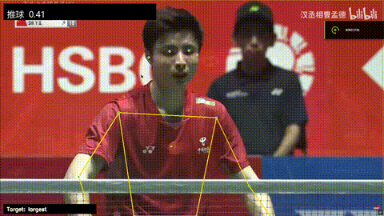
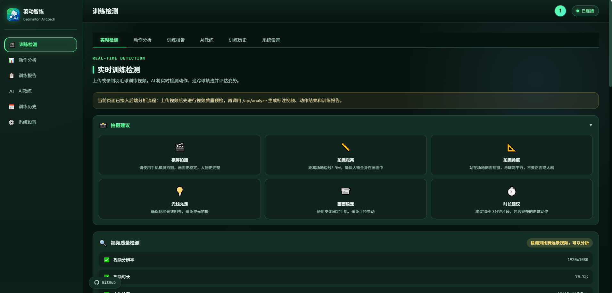
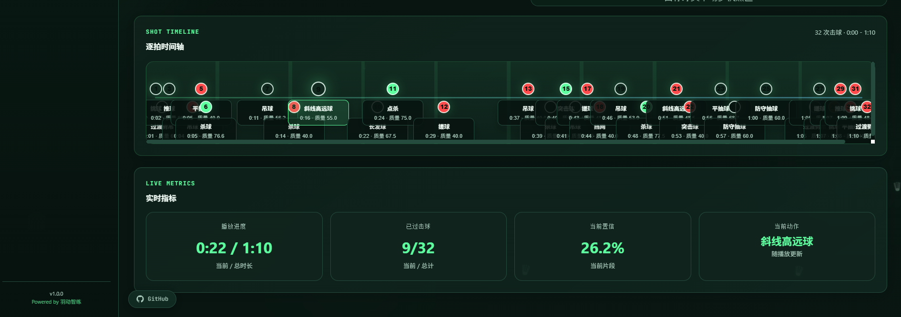
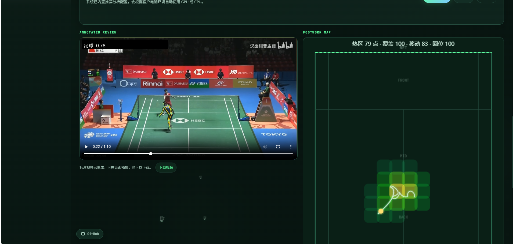
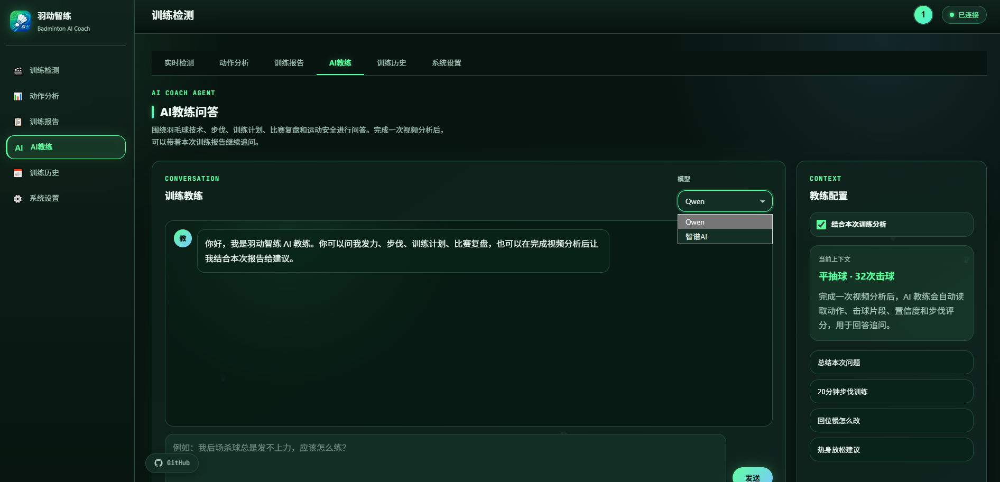
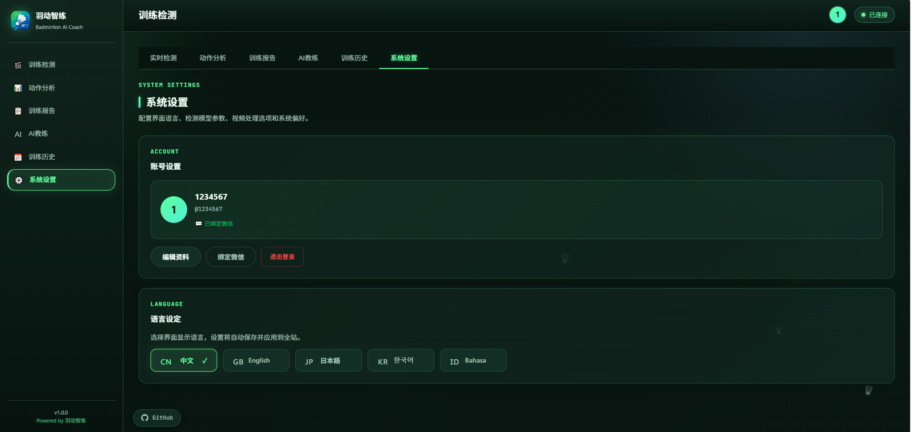
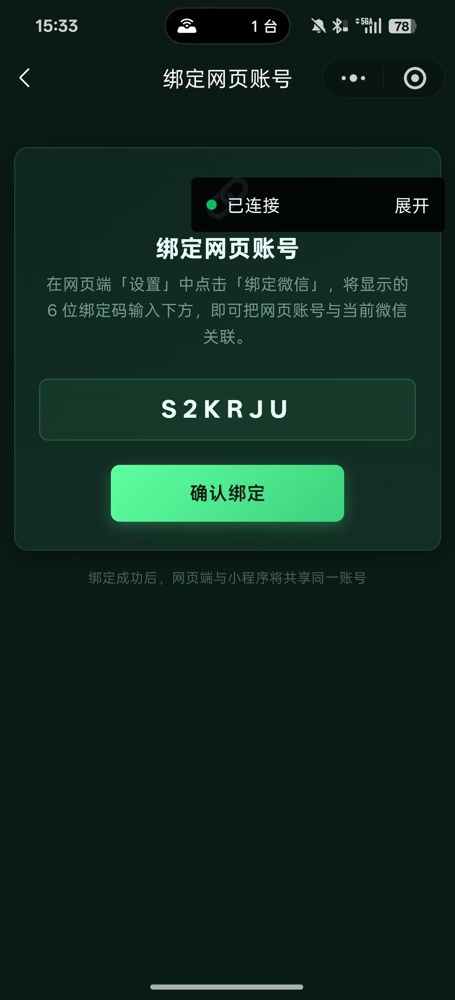
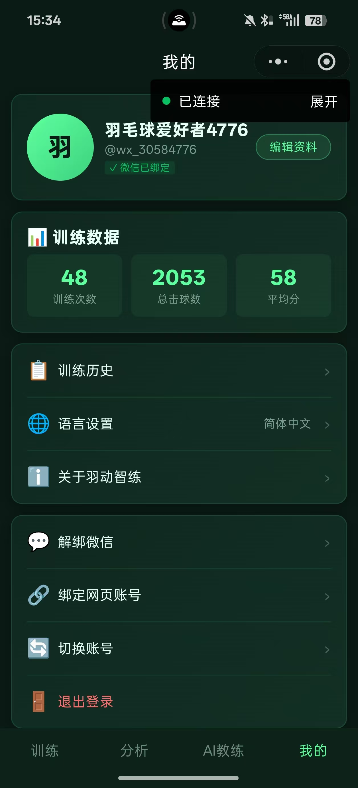
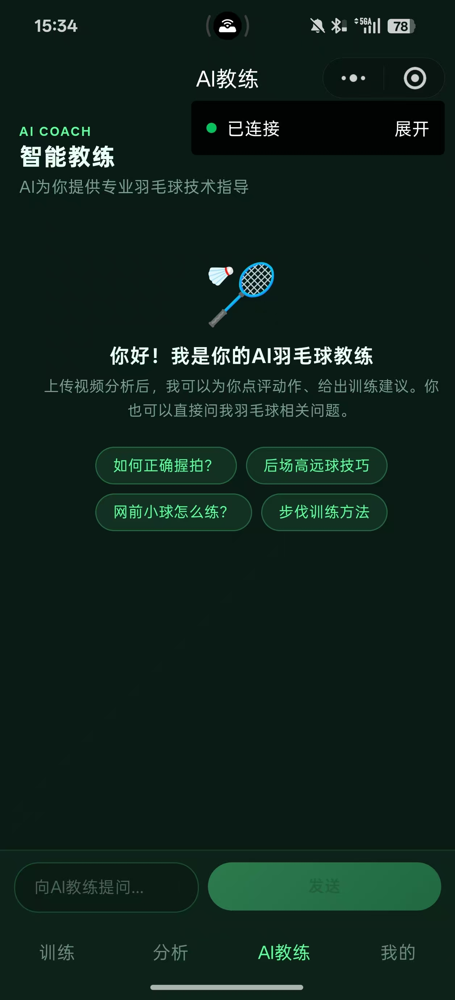
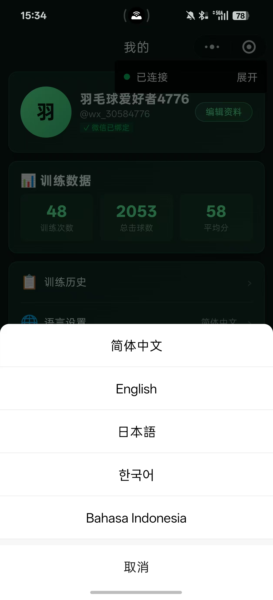

# 羽动智练 Badminton AI Coach

<p align="center">
  <a href="./README.md"></a>
  <a href="./README_EN.md"></a>
  
  
</p>

羽动智练是一套面向羽毛球训练复盘的 AI 智能教练系统。系统支持上传训练或比赛视频，自动完成姿态识别、动作分类、击球事件检测、步伐热力图、训练报告生成，并提供网页端与微信小程序端的联动体验。

项目目标是让普通羽毛球爱好者、校园社团和业余训练者，在没有专业教练长期陪伴的情况下，也能通过手机或网页获得可视化、数据化、个性化的训练反馈。

## 效果演示

<p align="center">
  
</p>

> 说明：上方 GIF 展示了上传视频后，系统生成标注视频、动作识别结果和步伐热力图的完整流程。

## 产品亮点

- 视频上传后自动分析人体关键点、击球动作和步伐移动。
- 支持比赛远景和近景训练两类场景，自动适配分析参数。
- 生成带骨架、动作标签、击球事件的标注视频。
- 提供半场步伐热力图，展示目标球员移动区域和移动轨迹。
- 逐拍时间轴展示每次击球的时间点、动作类型、置信度和质量评分。
- 训练报告汇总动作表现、步伐表现、重心稳定、手腕发力等指标。
- AI 教练支持结合训练报告回答问题，支持 Qwen 和智谱 AI 接口。
- 微信小程序端支持移动端训练入口、历史记录、AI 教练和网页账号绑定。

## 网页端功能

网页端是当前项目的主要训练复盘入口，适合电脑端演示、训练后分析和报告查看。

### 1. 实时训练检测

- 上传羽毛球训练或比赛视频。
- 自动进行视频质量预检，判断近景训练或比赛远景。
- 支持目标球员跟踪，减少多人画面误跟踪。
- 生成标注视频、步伐热力图和逐拍时间轴。
- 比赛远景模式已做速度优化，默认使用稳定预览帧率生成标注视频。

### 2. 动作分析

- 展示主要动作类型和动作质量评分。
- 评估挥拍流畅度、击球点精准度、身体协调、步伐移动、手腕发力和重心稳定。
- 输出检测历史记录，便于查看每一拍识别结果。

### 3. 训练报告

- 汇总训练时长、总动作数、最佳动作、总检测帧数。
- 提供能力雷达图和重点问题。
- 给出下一轮训练建议。
- 支持导出训练报告。

### 4. AI 教练

- 支持普通羽毛球问题问答。
- 支持结合本次训练报告进行针对性分析。
- 支持模型下拉选择，默认接入 Qwen，也预留智谱 AI。
- 回答内容已做格式清洗，避免展示 Markdown 占位符。

### 5. 系统设置

- 支持语言切换：中文、English、日本語、한국어、Bahasa Indonesia。
- 支持网页账号登录、微信小程序账号绑定。
- 交付版默认隐藏复杂模型参数，客户可直接使用。

## 微信小程序端功能

微信小程序端面向移动场景，适合训练者在手机上快速查看训练结果和账号数据。

### 主要页面

- 训练：手机选择或拍摄视频，上传到后端进行分析。
- 分析：查看动作结果、评分和训练反馈。
- AI 教练：围绕羽毛球技术、步伐、训练计划和比赛复盘进行问答。
- 我的：查看训练数据、历史记录、语言设置和账号绑定状态。

### 网页账号绑定

网页端可以生成 6 位绑定码，小程序端输入绑定码后，网页账号和微信账号会关联。绑定后可共享训练历史和用户身份。

绑定流程：

1. 网页端进入「系统设置」。
2. 点击「绑定微信」生成绑定码。
3. 小程序端进入「我的」页面。
4. 点击「绑定网页账号」并输入绑定码。
5. 确认绑定后，网页端和小程序端共享同一账号。

## 产品截图

### 网页端

训练检测页会先给出拍摄建议和视频质量检查，再进入后端分析流程。

<p align="center">
  
</p>

分析完成后，网页端可以播放标注视频，同时展示半场步伐热力图、逐拍时间轴和实时指标。

<p align="center">
  
</p>

标注视频会叠加动作类别、置信度、人体姿态骨架和脚步热力图，用于训练复盘。

<p align="center">
  
</p>

AI 教练支持 Qwen 和智谱 AI，可结合本次训练报告回答技术、步伐、训练计划和比赛复盘问题。

<p align="center">
  
</p>

系统设置页包含账号绑定、语言切换和交付后的固定配置入口，客户侧默认使用推荐参数。

<p align="center">
  
</p>

### 微信小程序端

小程序端可以通过网页端生成的 6 位绑定码绑定同一账号。

<p align="center">
  
</p>

绑定后，小程序端会展示训练数据、训练历史、语言设置和账号管理入口。

<p align="center">
  
</p>

小程序 AI 教练提供羽毛球技术问答入口，适合移动端快速咨询。

<p align="center">
  
</p>

语言设置支持简体中文、English、日本語、한국어 和 Bahasa Indonesia。

<p align="center">
  
</p>

## 技术架构

```text
badminton-agent/
├─ frontend/                  # 网页端
├─ badminton_agent_wx/         # 微信小程序端
├─ src/
│  ├─ api/                     # FastAPI 后端服务
│  ├─ inference/               # 姿态识别、动作分类、视频标注
│  ├─ action_classification/   # 动作分类训练与模型代码
│  ├─ court/                   # 球场映射与坐标转换
│  ├─ data/                    # 数据写入工具
│  └─ detection/               # 目标检测扩展模块
├─ models/                     # 动作分类模型
├─ outputs/                    # 运行输出，默认不提交
├─ start_web.bat               # Windows 一键启动脚本
├─ requirements.txt            # Python 依赖
├─ .env.example                # 环境变量示例
└─ README.md
```

## 核心技术

- FastAPI：后端 API 和媒体服务。
- OpenCV：视频读取、帧处理、标注视频生成。
- Ultralytics YOLOv8-Pose：人体姿态关键点检测。
- PyTorch：姿态序列动作分类模型推理。
- TCN + GRU：姿态序列动作分类。
- SQLite：用户、训练历史和报告记录。
- Qwen / 智谱 AI：AI 教练和训练建议生成。
- 微信小程序：移动端训练与账号绑定入口。

## 快速启动

### 方式一：一键启动

Windows 下双击：

```text
start_web.bat
```

启动成功后访问：

```text
http://127.0.0.1:8000/frontend/
```

### 方式二：手动启动

```powershell
pip install -r requirements.txt
python -m uvicorn src.api.server:app --host 127.0.0.1 --port 8000
```

然后打开：

```text
http://127.0.0.1:8000/frontend/
```

## 环境配置

复制 `.env.example` 为 `.env`，根据需要填写：

```env
DASHSCOPE_API_KEY=你的QwenKey
ZHIPUAI_API_KEY=你的智谱AIKey
```

如果不配置大模型 Key，核心视频分析仍可使用，AI 教练和大模型训练建议会受限。

## 模型文件

运行前请确认以下文件存在：

```text
models/pose_sequence_tcn_gru.pt
yolov8s-pose.pt
```

`yolov8s-pose.pt` 可由 Ultralytics 自动下载；动作分类模型 `pose_sequence_tcn_gru.pt` 需要放在 `models/` 目录下。

## 训练与数据来源

本项目动作分类训练使用公开羽毛球视频数据集 [VideoBadminton](https://github.com/qilimk/VideoBadminton) 作为主要数据来源。该数据集提供羽毛球比赛视频片段与动作类别标注，适合用于羽毛球动作识别、姿态序列建模和逐拍动作分类实验。

仓库中保留了训练与特征提取相关代码：

```text
src/pose_estimation/extract_pose.py              # 基于 YOLOv8-Pose 批量提取人体关键点
src/pose_estimation/visualize_pose.py            # 姿态识别结果可视化
src/feature_engineering/extract_features.py      # 羽毛球专项姿态与运动特征提取
src/action_classification/train_classifier.py    # 早期动作分类训练脚本
src/action_classification/train_classifier_v2.py # 改进版动作分类训练脚本
src/action_classification/train_pose_sequence_classifier.py # 当前主要姿态序列分类训练脚本
src/action_classification/train_hierarchical_classifier.py  # 分层动作分类实验脚本
```

为了控制仓库体积并尊重公开数据集分发方式，以下内容不直接提交到 GitHub：

- VideoBadminton 原始视频与派生片段。
- `data/pose_features/` 中的大量姿态特征 `.npy` 文件。
- `data/badminton_features.json` 等可重新生成的特征文件。
- `yolov8s-pose.pt`、`models/*.pt` 等模型权重文件。

如需复现实验，请先按 VideoBadminton 仓库说明获取数据集，再运行姿态提取、特征工程和动作分类训练脚本。

## 性能优化

当前版本已经加入以下优化：

- YOLO-Pose 模型缓存，避免重复加载。
- 同视频同配置复用标注视频缓存。
- 比赛远景模式自动使用更快的采样策略。
- 标注视频支持稳定预览帧率输出，缩短生成时间。
- 默认关闭逐拍短片导出，减少无效转码。
- 前端使用 SSE 实时显示分析进度。
- 支持 NVENC / FFmpeg 视频编码加速。

推荐安装 FFmpeg：

```powershell
ffmpeg -version
```

如果无法识别该命令，请安装 FFmpeg 并加入系统 PATH。

## 推荐视频规范

- 推荐时长：10 秒到 3 分钟。
- 推荐分辨率：720p 或 1080p。
- 推荐拍摄：横屏、固定机位、侧面拍摄。
- 训练近景：目标球员尽量完整出现在画面中。
- 比赛远景：建议选择目标球员或保持画面稳定。

## API 简述

主要接口：

```text
POST /api/precheck      视频质量预检
POST /api/analyze       视频分析，返回 SSE 进度和最终报告
GET  /api/media/{file}  标注视频播放和下载
POST /api/coach/chat    AI 教练问答
```

## 微信小程序配置

小程序代码位于：

```text
badminton_agent_wx/
```

使用微信开发者工具打开该目录。真机调试时，需要在：

```text
badminton_agent_wx/miniprogram/app.js
```

将 `API_BASE` 改为电脑局域网 IP，例如：

```js
const API_BASE = "http://192.168.1.5:8000";
```

后端启动时建议使用：

```powershell
python -m uvicorn src.api.server:app --host 0.0.0.0 --port 8000
```

手机和电脑需连接同一 WiFi。

## 当前版本

当前版本：`v1.0.0`

这个版本已经具备完整的训练复盘闭环：

```text
视频上传 -> 姿态识别 -> 动作分类 -> 击球事件 -> 步伐热力图 -> 标注视频 -> 训练报告 -> AI 教练
```

## 注意事项

- `.env`、`outputs/`、模型调试输出和用户数据库不会提交到 GitHub。
- 视频分析速度与 GPU、视频长度、分辨率和 FFmpeg 环境有关。
- AI 教练回答仅作为训练建议，不替代专业医疗或康复建议。
